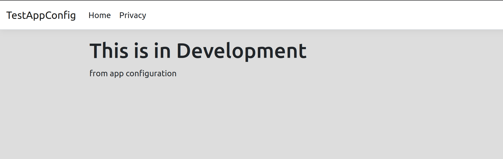
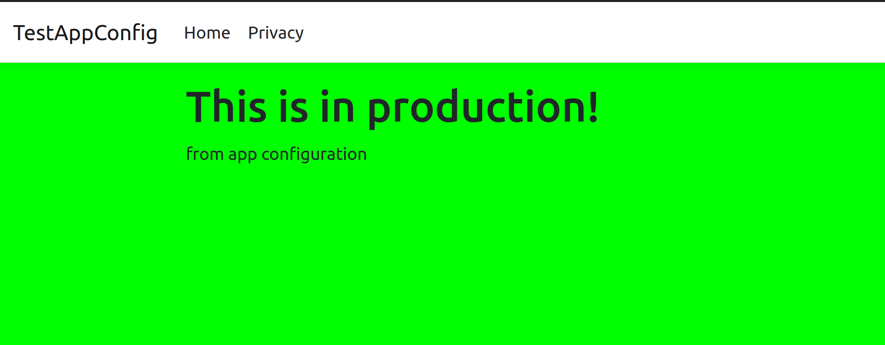

# Azure App Configuration Demo

I tested out Azure App Configuration (AAC) using this MVC project. A cool feature of AAC is [managed identities](https://docs.microsoft.com/en-us/azure/azure-app-configuration/howto-integrate-azure-managed-service-identity?tabs=core5x&pivots=framework-dotnet), which this demo, erm, demoes. Sadly this feature is not supported in a local environment, hence the ternary operation to use the endpoint **or** connection string depending on the environment.

I like how easy it is to setup configuration across environments, using `IWebHostEnvironment.EnvironmentName` to match up with an AAC `label` property. I used different background color and text depending on the environment, and here's the result:

## What it looks like in local development

## What it looks like in production

